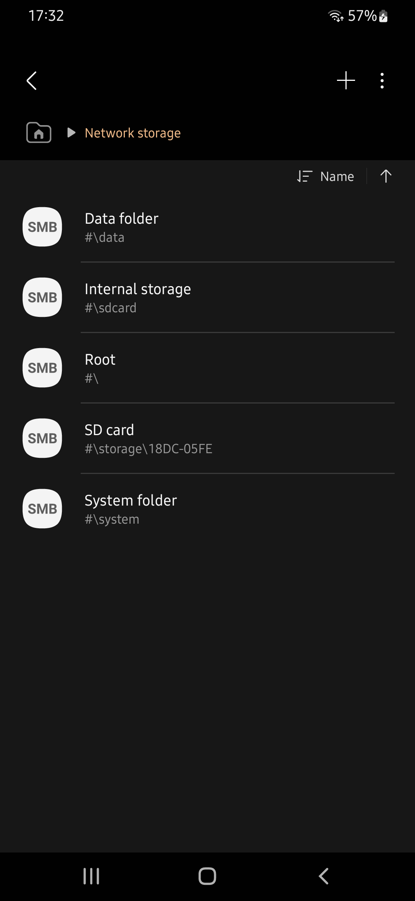
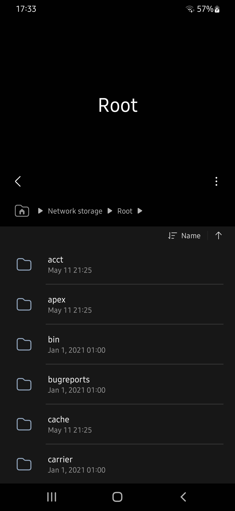
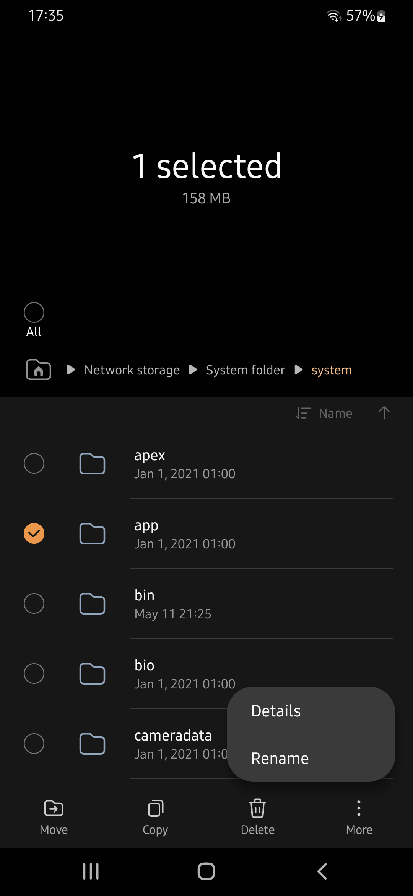

#  My Files Root Extension
This will allow the [Samsung My Files](https://play.google.com/store/apps/details?id=com.sec.android.app.myfiles) app to access the root directory of your rooted android device without modding it. It makes it possible because it's replacing the ``Network Storage Manager`` (com.samsung.android.app.networkstoragemanager), a separate app which provides folder and file information to the Samsung My Files app and handles file operations. So instead of providing server files, this app will provide files from the root directory and handle operations with root rights. You can download and install the latest apk [here](https://github.com/Yanndroid/My-Files-Root-Extension/raw/master/app/release/app-release.apk). Unfortunately, due to how Samsung intended this feature, it will require an internet connection. This app also has a cache for file lists, but if a folder contains a lot of files, it may take some time to load them all for the first time.

  